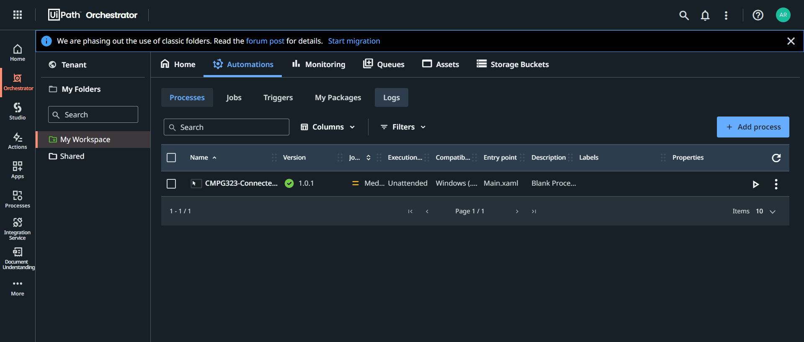
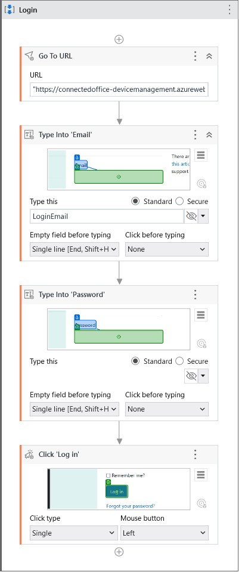
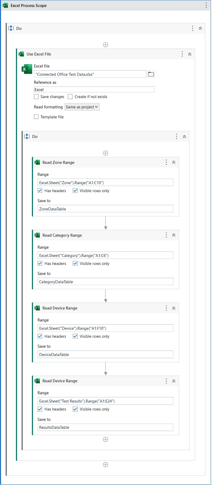
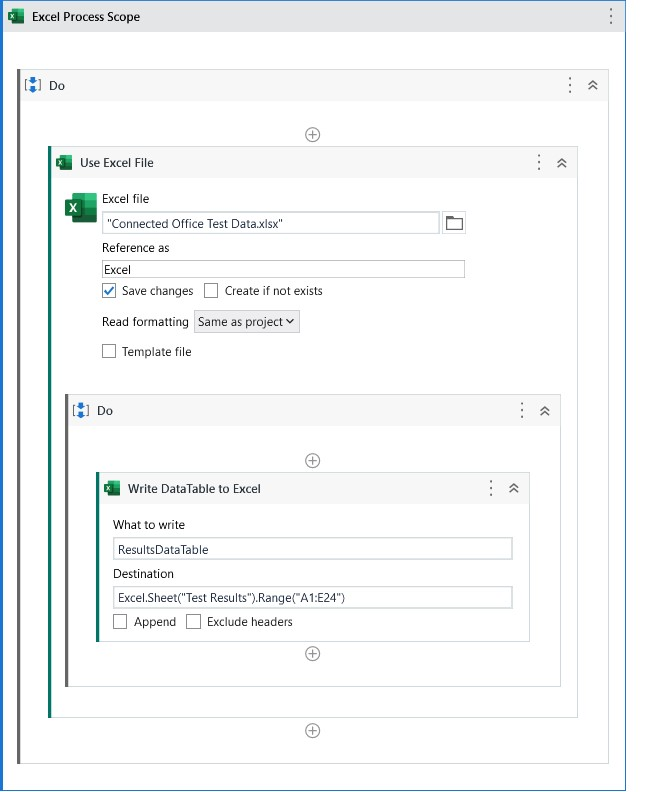
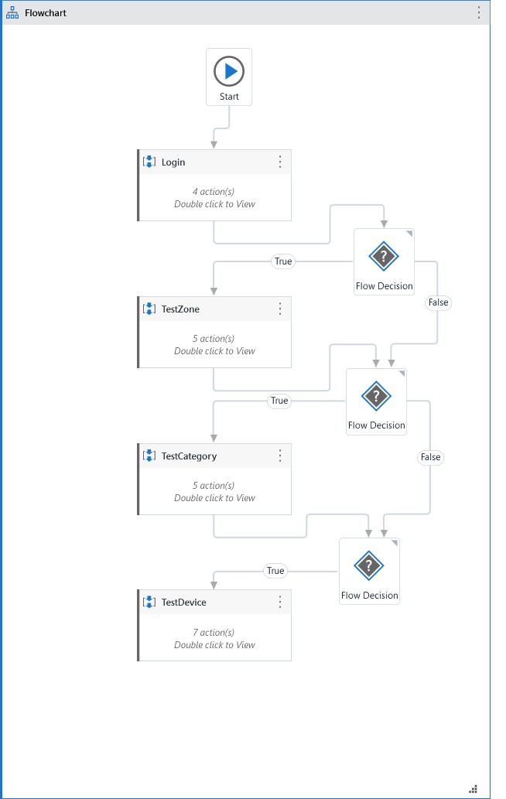

# CMPG323-Project-4---35359099
## RPA & Automation
### 1. Variables
The following variables may be adjusted to change the behaviour of the UI Path project.

| Name|Scope|Description|Default|
| ------------- | ------------- |------------- |------------- |
|LoginEmail|Main | Email used to login to the web application | NONE
| LoginPassword | Main | Password used to login to the web application | NONE
| TestZone | Main | If the CRUD operations for Zones should be tested | True
| TestCategory | Main | If the CRUD operations for Categories should be tested | True
| TestDevices | Main | If the CRUD operations for Devices should be tested | True

Please note the variables for LoginEmail and LoginPassword must be filled for the application to successfully log in.

### 2. Orchestrator Hosting
This project has been hosted on UI Path Orchestrator

### 3. Login Flow
Flow for the login process

### 3. Reading data from Excel
All neccessary data is read from Excel Ranges and then populated into DataTables. The DataTable variables have the scope of Main and can be accessed by every other process. 

### 4. Writing data to Excel
I update the values of all test cases to the ResultsDataTable then I write the entire ResultsDataTable into the Excel file after all tests are complete.

### 4. Adjustable Behaviour
I use a flow chart in order to adjust the behavior of the project based on the variables specified. This determines which Test Cases should be completed.

### 5. Reference List

- TheAutomationGuy, 2022. Introduction to UiPath Portal, Orchestrator & Studio. [Online] 
Available at: https://www.youtube.com/watch?v=BAYmmUuB2Zo
[Accessed 26 10 2022].
- UI Path, 2018. Publishing a Project from Studio to Orchestrator. [Online] 
Available at: https://docs.uipath.com/orchestrator/v2018.1/docs/publishing-a-project-from-studio-to-orchestrator
[Accessed 27 10 2022].
- UI Path, 2022. Excel Automation with Studio. [Online] 
Available at: https://www.uipath.com/learning/video-tutorials/excel-datatables-automation
[Accessed 25 10 2022].
- UI Path, 2022. Managing Variables. [Online] 
Available at: https://docs.uipath.com/studio/docs/managing-variables
[Accessed 25 10 2022].
- UI Path, 2022. Read, Write, and Append Data in Excel. [Online] 
Available at: https://docs.uipath.com/activities/docs/read-write-and-append-data-in-excel
[Accessed 27 10 2022].

